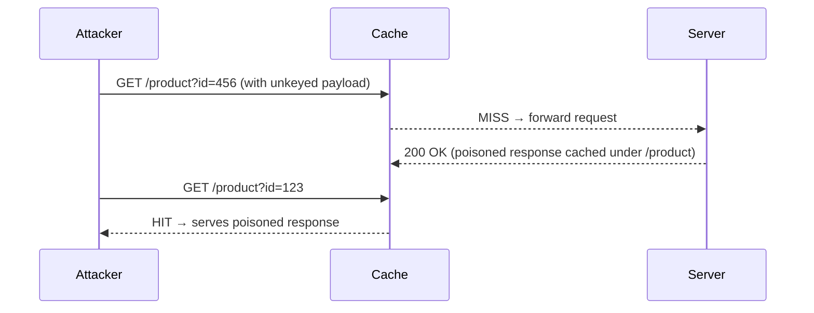

> [!summary]  
> **Black‑Box Web Cache Poisoning Strategy** — A step‑by‑step approach using only the provided cache‑poisoning notes: identify unkeyed inputs, confirm cache behavior, craft payloads, poison shared caches, and verify impact.

---

## 1  Scope & Reconnaissance

|Task|Method|
|---|---|
|Identify cache layer|Inspect response headers for `X-Cache` / `X-Edge-Cache`|
|Enumerate endpoints|Crawl application UI; note paths (`/`, `/product`, `/news`)|
|Record cache configuration|Retrieve Nginx/Varnish/Cloudflare docs or headers|

> [!tip]  
> A fresh cache miss (`X-Cache: MISS`) → wait or add a cache buster to trigger poisoning.

---

## 2  Discover Unkeyed Inputs

### Manual Header Testing

1. Send a baseline `GET /path` → note `X-Cache: MISS`
    
2. Resend → note `X-Cache: HIT`
    
3. Inject uncommon header:
    
    ```http
    X-Test: 123
```
    
4. Observe if response changes (search for “123”) and whether cache still hits → if yes, `X-Test` is unkeyed.

### Param Miner (Burp Suite)

- **Extensions → Param Miner → Guess headers**
    
- Look for injected headers affecting response but yielding cache hits.


### Query Parameter Testing

1. Baseline `GET /?ref=1` → MISS then HIT
    
2. Change `ref` value → if cache still HIT and page reflects new value, `ref` is unkeyed.
    
3. Use `?cb=1` as cache buster to control entry timing.

---

## 3  Confirm Cache Behavior



> [!note]  
> Ensure you’re hitting the **edge cache** (e.g., Nginx on port 8081), not bypassing it.

---

## 4  Crafting Poisoning Payloads

|Attack Type|Example Input|
|---|---|
|**Stored XSS**|`Accept-Language: <script>alert(1)</script>`|
|**Phishing Redirect**|`GET /redirect?url=http://attacker.com` (cache key ignores `url`)|
|**Denial of Service**|`Host: victim.com:81` → 500 error cached under `/`|
|**SSRF + Cache Leak**|`X-Forwarded-Host: 169.254.169.254` on `/avatar?user=123`|

> [!tip]  
> After injection, wait for cache MISS/HIT cycle to store the poisoned response.

---

## 5  Poisoning Workflow

1. **Expire or bypass cache** (`?cb=1`)
    
2. **Inject payload** via unkeyed input
    
3. **Verify reflection** in response (search for your marker)
    
4. **Let cache store** the response (observe `X-Cache: MISS` → then `HIT`)
    
5. **Validate in incognito** or from another client to confirm universal effect
    

---

## 6  Exploitation Checklist

-  Locate cache layer and confirm `MISS`/`HIT` headers
    
-  Identify unkeyed header(s) or query parameter(s)
    
-  Use rare marker (e.g., `aardvark`) to confirm reflection
    
-  Craft and send malicious input
    
-  Observe cache store (wait cache-valid interval)
    
-  Access from a clean session to confirm payload execution
    

---

## 7  Tools & Techniques

|Category|Primary|Alternative|
|---|---|---|
|Proxy Intercept|Burp Suite|mitmproxy|
|Header Fuzzing|Param Miner|manual header injection|
|Cache Control|`?cb=` cache buster|wait for expiry|
|Verification|Incognito browser|curl from different IP|

---

## Key Takeaways

> [!important]
> 
> - **Unkeyed inputs** (headers/params ignored by cache) are your leverage points.
>     
> - **Param Miner** accelerates discovery, but always **manually validate**.
>     
> - **Cache busters** (`cb`) and timing are crucial to ensure you’re the first request.
>     
> - **Always verify** in a fresh context (incognito/new client) to prove a successful poison.
>     
> - **Stored XSS**, **redirects**, **DoS**, and **SSRF leaks** are all achievable via web cache poisoning.
>     

_Last updated: {{DATE:YYYY-MM-DD}}_